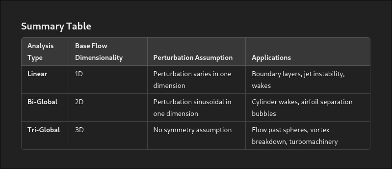

# 25/11/2024

 * Today I learned the *Arnoldi iteration* for finding the largest eigenvalue of a general matrix. It consists on, given a random initial vector $b$, to apply the power iteration to the matrix $A$ and the vector $b$, that is, compute $Ab$, $A^2b$, $A^3b$. This converges eventually to the largest eigenvector of $A$, because of the general decomposition $A=Q\Lambda Q^{-1}$, with $Q$ being the matrix of eigenvectors and $\Lambda$ the diagonal matrix of eigenvalues.
 
 * In continuous dynamics, the instability happen when $\Re \lambda > 0$, with $\lambda$ being the eigenvalues of the linearized operator of the system. Thus, what we are actually computing in the Arnoldi iteration is the largest eigenvalue of the matrix $\exp(L* T)$ where $u_t=L u$ is the linearized operator of the system, and $T$ is the time step between Arnoldi iterations. So, if $\lambda=\sigma + i \omega$, is the unstable eigenvalue we are interested in ($\sigma$ being the growth rate and $\omega$ the frequency), and $\lambda_A=\abs{\lambda_A}\exp(\phi i)$ is the largest eigenvalue of the matrix $\exp(L * T)$, we have that $\sigma = \frac{\log(\abs{\lambda_A})}{T}$ and $\omega = \frac{\phi}{T}$.

 * It is interesting to note that the output eigenvalue $\lambda_A$ is actually of interest too. Eventually the continuous linearized operator $L$ is discretized to a matrix $L_{h,p}$ (we keep calling it $L$). This matrix is then used as to iterate the solution $u^n$ in order to get the solution one step further $u^{n+1}$. Since the system is linear, the solution is given by $u^{n+1} = \exp(L * T) u^n$. Thus, the convergence of the iterative system is directly related to the magintude of $\lambda_A$ (that being greater than 1 or less than 1).

 * For TriGlobal analysis, when the perturbated solution is assumed to be of the form $u(x,t)=sum_j a_i q(x) e^{\lambda_j t}$, just think in separation of variables to deduce this formula, when we are in the linearized case of NS: $\partial_t u = L u$, with $L$ being the linearized operator of the Navier-Stokes equations.

Summary of the linear, biglobal and triglobal stability analysis:

